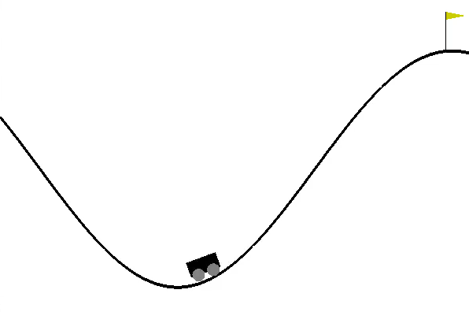
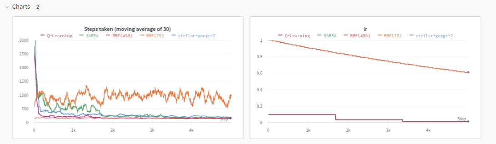
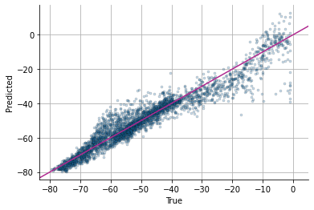
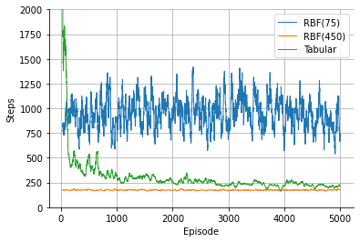
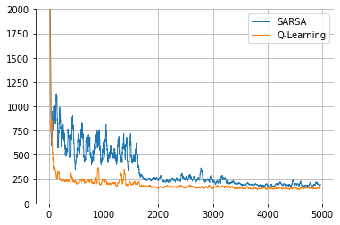
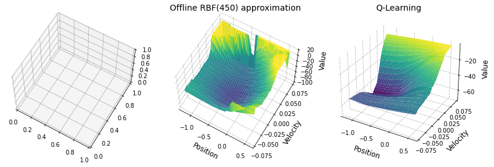

# Mountain Car Problem
### Training an agent to drive up a mountain

A challenge from the [OpenAI Gym](https://gym.openai.com/envs/MountainCar-v0/)  

## Background

The challenge is for the car to drive up the mountain from a starting position in the middle of the valley. The difficulty is that the car's engine is not powerful enough to drive straight up the mountain. Instead, the car needs to reverse back to gather the momentum before going up the hill full speed. In this project several different AI learning techniques will be applied which will help the agent learn on its own how to complete the task.

The project is split into 4 core notebooks, the first three explore different approaches in solving the problem. The fourth one summarises the findings.

Learning artefacts and parameters are stored in [wandb](https://wandb.ai/vinas/MountainCarProblem).

## Implementation

This problem has a finite state and action space. The states are defined by a tuple of car's position and velocity. Position ranges from -1.2 to 0.6, while velocity ranges from -0.07 to 0.07. At every state the agent can choose one of three possible actions: accelerate left (reverse), do nothing, accelerate right.

The agent needs to learn the State-Action value function in order to make appropriate decisions which will lead the car to the top of the mountain.

### 1. Tabular method

A tabular method's approach is to approximate the continuous State-Action space by a discretised table. Each of the state's axis (position and velocity) are uniformly split into 40 sections. Then a 40x40x3 tensor of a discretised State-Action space is created. Each element in this tensor represents the value of a given State-Action combination. This tensor is initially populated with zeros, meaning that the agent is not aware of its environment and has equal preferences for all states and actions. The agent is then initiated under an $\epsilon$-greedy policy where it takes a random action with a small probability $\epsilon$ and otherwise takes whatever action is of the highest value for the current state. The agent then moves around the states updating the discretised State-Action values at every step using the following formula:

where Q is the State-Action quality function, $\alpha$ is the learning rate, $\gamma$ is the discounting constant, and the letters S, A, R represent the state, action and reward respectively. Complete algorithm is in the [RL book by Sutton & Barto](http://incompleteideas.net/book/RLbook2020.pdf).

This algorithm runs for multiple episodes. The first few episodes it takes the agent several thousand steps in order to complete the task. By the 1000th episode, however, agent manages to drive up the mountain within 300 steps. By the final episode it gets close to 200 steps.

The weakness of this approach is that it is rather slow to learn (especially in the beginning) and that it only assigns values to those State-Actions that the agent has visited. Thus if the state space was slightly expanded, agent wouldn't know how to act there. Furthermore, it requires discretisation of the State-Action space at every step which means that technically only very few State-Action combinations have been evaluated out of infinite possibilities. 

### 2. RBF approximation

The last two aforementioned issues with the tabular method regarding a limited and discretised State-Action space can be solved by approximating the whole value function. This can be done by transforming the State-Action value table using a number of Radial Basis Functions (RBFs) and then approximating it via linear regression. In this setting the RBF transformed State-Action pairs would make up the design matrix while the corresponding values would be the regression targets. Figure 1 displays a scatter plot of true (acquired though the tabular method) and predicted (from RBF regression) values.

<figure>
  
  <figcaption>Figure 1: True vs Predicted using 450 RBFs.</figcaption>
</figure>
 
 

Using this method, no learning takes place. State-Action values are acquired though a linear combination of RBF transformed state-action combination and a set of weights which were acquired though fitting a linear regression model based on the learning from the tabular method.

With a carefully chosen number of RBFs, this approach can outperform the tabular method as can be seen in Figure 2.

<figure>
  
  <figcaption>Figure 2: Steps till completion, Moving Average of 30.</figcaption>
</figure>
 
 

Here the RBF methods do not actually learn anything, their performance is consistent throughout the whole 5000 episodes. The RBF(450) model still slightly outperforms the tabular method.

### 3. SARSA + Q-Learning

The RBF method explored earlier is applied offline. The Agent first explored the environment to collect the data about the states and only then RBFs were fitted which approximated the State-Action values. Instead, some online learning methods such as SARSA and Q-Learning can be used which learn the weights of the RBF model iteratively, one step at a time. These models share some similarities with the Tabular approach. The agent continues to follow $/epsilon$-greedy policy. However, this time, Action-State values are not read off a table but instead approximated using RBF regression. Furthermore, as there is no quality table, learning happens through updates to the RBF weights directly.

For the SARSA algorithm, the weight update logic is shown below. At every step, the weight update
happens according to the first line if the agent completed the task, or using the second one otherwise.

The only difference to the algorithm for Q-Learning is that the quality function of state $S'$ is always maximised. More specifically, $Q(S',A',w)$ turns into $max_aQ(S',a,w)$ regardless of what action was actually chosen under the policy.

Both online learning algorithms were run for 5000 episodes with steps till completion recorded. The number of RBFs was set at 1000. The Q-Learning agent started off by very quickly learning the environment as the steps till completion dropped to around 250 just 100 episodes in before stabilising around 144. SARSA agent performed much worse at first, before stabilising at 170 - a reasonably good result, though still significantly higher than of Q-Learning. For comparison, the offline RBF agent reached similar values to Q-Learning - 154 steps.

<figure>
  
  <figcaption>Figure 3: Steps till completion, Moving Average of 30.</figcaption>
</figure>
 

## Summary

<figure>
  
  <figcaption>Figure 4: State space value surfaces for different learning methods.</figcaption>
</figure>
 
 

The methods applied in this report approximate state values for every possible action. These approximations can be used to create state space quality surfaces. Some of these surfaces are displayed in Figure 4. Interestingly, all of the shapes are rather distinct, yet have some key common features. For the Tabular method, there is a valley in the center with heights around 0.5 position and high velocity. Some of the state values around the borders of the surface are missing - the agent never explored there. Offline RBF approximation looks very similar, yet it has values assigned for the unvisited states. The Q-Learning quality surface is completely different though. It is very smooth, with heights around high velocity.